# Botany 2021 workshop: Data Collection to Analysis: Landscape Genomics with CartograPlant and WildType. July 18, 2021

## Index
0. [Introduction](#intro) 
1. [Data Quality Filtering](#data) 
2. [Population structure](#pop) 

    2.1. [DAPC](#dapc)

    2.2. [Principal Component Analysis (PCA) and fastSTRUCTURE](#pcafast)

3. [BLUPs calculation](#blup) 
4. [Genome Wide Association Analysis (GWAS)](#gwas) 

    4.1. [EMMAX](#emmax)

    4.2. [Fast-EB-LMM](#fast)
    
5. [Genome-Environment association analysis (GEA) and epigenome-wide association studies (EWAS) with LFMM 2](#gea)
6. [Multiple testing correction](#multi) 
7. [Meta-analysis with METASOFT](#meta)


<a name="intro"></a>
## 0. Introduction

This part of the workshop consists on a "demo" to show the potential for data analysis of CartograPlant (https://treegenesdb.org/ct). To this end, CartograPlant makes use of *Galaxy* (https://galaxyproject.org/), a user-friendly platform that allows the bioinformatic analysis of high throughput data without the need of coding skills.

The analytic workflow presented here, whose some steps are currently available in CartograPlant and others will be available soon, takes advantage of the strengths of this web application: the diversity of data types (genotypic, phenotypic and environmental), the metadata collection using standards and associated ontologies, including the Minimum Information About a Plant Phenotyping Experiment (MIAPPE), and the robust integration of regional and global environmental layers. *Populus trichocarpa* was used as a model to develop the workflow, and will be used here to perform the demo, due to its compact genome size, which makes it very convenient to sequence and analyze, and its economic and ecological importance, which has lead to a high number of available genomic and phenotypic resources for this species.

In particular, this workflow allows the performance of **genome-wide association analysis (GWAS)** (genome-phenotype associations for the moment, but genome-environmental associations will be available soon) and **meta-analysis** (will be also available soon), which is possible thanks to the metadata collection, associated with the public studies, allowing the integration of genomic, phenotypic and environmental data.

In particular, we are using two SNP panels of *P. trichocarpa* natural populations, belonging to two GWAS studies: Panel 1 (Zhang *et al.* 2019) and Panel 2 (Evans *et al.* 2014). These to studies are ideal to show the features of CartograPlant, since some of the individuals are common among the two studies, as well as some phenotypic variables (bud set, bud flush and height, among others). Previous to access the Galaxy instance to perform data analysis, CartograPlant allows to filter the individuals by study, species etc, identify phenotypes and individuals in common among studies, select the environmental layers of interest and the workflow you want to use.

The study design of both studies utilizes *P.trichocarpa* individuals, sampled spanning much of the species' natural latitudinal range. Both studies also contain clonal replicates, performing spatial and temporal replications within common garden locations to perform large-scale phenotyping.


<a name="data"></a>
## 1. Data quality filtering

**SNP quality control filtering** is a key step previous to further data analysis, such as Genome-Wide Association Analysis (GWAS), since it removes markers/individuals likely containing genotyping errors, ensuring the accuracy of the results. A standard SNP quality filtering for GWAS usually consists on the following steps:


- **Missigness per individual:** Removing individuals having more than a given percentage of missing data.

- **Minor allele count per marker:** Removing SNPs with a minor allele count lower than a given value.

- **Minimum quality score:** Removing SNPs with a quality score lower than a given value.

- **Minimum reads per marker (Depth):** Removing SNPs with less than a given number of reads.

- **Missigness per marker:** Removing SNPs with more than a given percentage of missing individuals per genotype.

- **Minor allele frequency:** Removing SNPs with a minor allele frequency lower than a given value.

- **Mendelian errors (for family-based data only):** Discarding families with more than a given frequency of Mendel errors (considering all SNPs) and also excluding SNPs with more than a given frequency of Mendelian error rate.

However, deciding the most suitable quality control filtering thresholds for your dataset can be tricky, since they depend on multiple factors. On the one hand, an excesively lax quality filtering threshold can reduce the quality of the SNP dataset, and thus, the accuracy of the results, as well as innecessarily increase the computational time. On the other hand, a too strict threshold can lead to a loss of important information, since it can lead to the removal of good quality SNP data.

**Imputation** of lacking SNPs is another important step in GWAS. It consists on the inference of the lacking SNPs on the dataset to increase the association power. The imputed genotypes expand the set of SNPs that can be tested for association, and this more comprehensive view of the genetic variation in a study can enhance true association signals and facilitate meta-analysis.

The selection of suitable quality filtering thresholds is also beneficial for this imputation step, since imputation methods most often make use only of genotypes that are successfully inferred after having passed these quality filtering threshold.
Most existing genotype imputation methods use patterns from known genotypes to impute missing genotypes. For model species, this imputation step is usually performed by combining a reference panel of individuals genotyped at a dense set of polymorphic sites (usually single-nucleotide polymorphisms, or “SNPs”) with a study sample collected from a genetically similar population and genotyped at a subset of these sites. This imputation method predicts unobserved genotypes in the study sample by using a population genetic model to extrapolate allelic correlations measured in the reference panel. To this end, markers from both reference and study panel must be ordered or phased. Consequently, this imputation method can be tricky to implement in non-model species, since requires high-quality reference genomes.

**LinkImputeR** (Money et al. 2017) is a program that tests for different filter parameters to perform data quality filtering, in order to maximize the quantity and quality of the resulting SNPs, while maintaining accuracy/correlation values. As a result, LinkImputeR provides a series of combinations of thresholds or "Cases", so that users can decide on thresholds that are most suitable for their purposes. As a consequence, it improves the power of downstream analysis. Once the best SNP quality filtering threshold (aka Case) is selected, LinkImpute uses it to perform imputation of lacking SNPs. This imputation step is specifically designed for non-model organisms since it requires neither ordered markers nor a reference panel of genotypes.
To this end, LinkImputeR uses an imputation method called LD-kNN Imputation, which is based on looking for SNPs in Linkage Disequilibrium (LD) with the lacking SNP to be imputed. Thus, to impute a genotype at SNP a in sample b, LD-kNNi first uses the l SNPs most in LD with the SNP to be imputed in order to calculate a distance from sample b to every other sample for SNP a. The algorithm proceeds by picking the k nearest neighbours to b that have an inferred genotype at SNP a and then scoring each of the possible genotypes, c g , as a weighted count of these genotypes.

The data quality filters tested and implemented in LinkImputerR are depth, minor allele frequency, and missingness by both SNP and sample. Thus, the rest of the quality filters (minor allele count per marker and minimum quality score) have to be performed before running LinkImputeR.

Although the code will show hereafter the Panel1 data set, we will run it in both panel simultaneously, since we need the GWAS results (summary statistics) of both of them to perform the final meta-analysis, which is the ultimate objective of this workflow.

### Step 1: Go to "Run Analysis" tab in CartograPlant Analysis

You will see something like this:

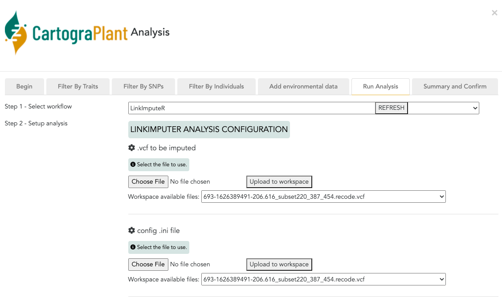

### Step 2: Select "SNP Quality filtering Step 2: Minor Allele Count per marker"

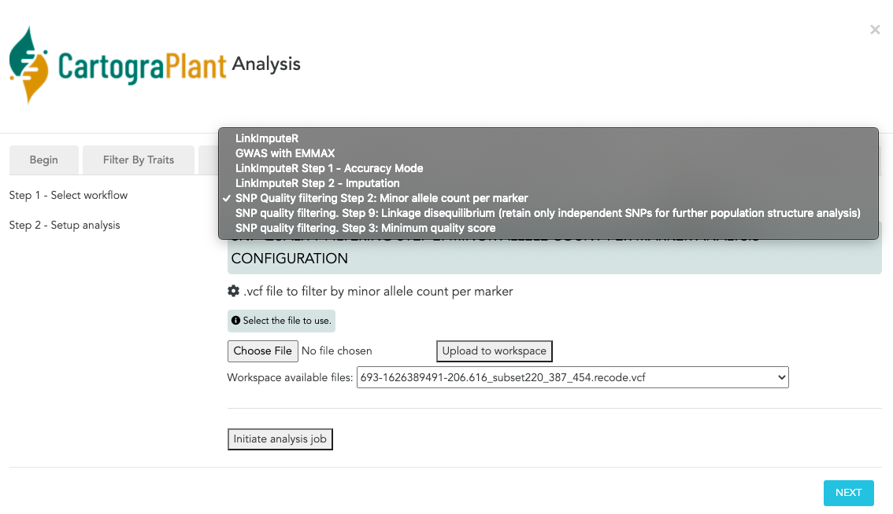


**1.** Now we need to perform minor allele count per marker (mac) and minimum quality score (minQ) filters using *vcftools* (LinkImputeR does not perform these two data quality filtering steps). We will use a minimum allele count of 2 and minimum quality score of 20. We need a vcf file containing the SNPs as input file for this SNP Quality filtering Step 2 (obtained from the individuals selected in CartograPlant or uploaded from our computer):

### Select "SNP Quality filtering Step 2: Minor Allele Count per marker"


- **SNP Quality filtering Step 2**
### Code:
```
vcftools --vcf 206.616_subset2.vcf --mac 2 --recode --recode-INFO-all --out 206.616_subset2.mac2
```

### Select "SNP Quality filtering Step 3: Minimum Quality Score" and run this Step 3 using the output of the Step 2


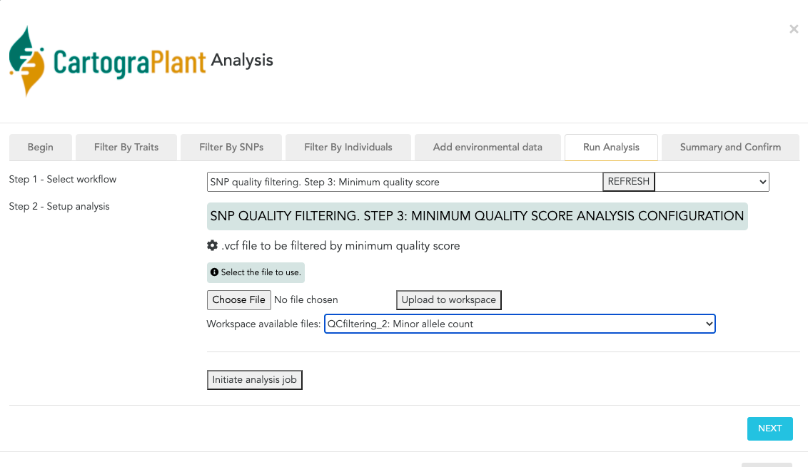

- **SNP Qualilty filtering Step 3**
### Code:
```
vcftools --vcf 206.616_subset2.mac2.recode.vcf --minQ 20 --recode --recode-INFO-all --out 206.616_subset2.mac2.minQ20
```

**2.** Run LinkImputeR in accuracy mode (LinkImputeR Step 1: Accuracy Mode). We will use the filtered SNPs as input (output from the SNP Quality filtering Step 3)


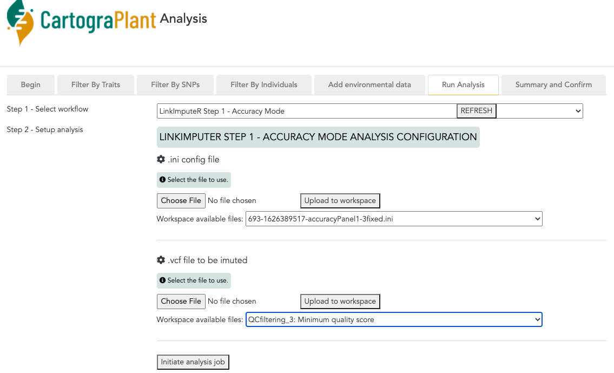

- Upload in CartograPlant (input) control file in *.ini* format:

*accuracy.ini*

```
[Input]
filename = workflow.vcf # LinkImputeR takes a standard VCF file as input. LinkImputeR filters input data for biallelic SNPs before performing any other steps. The input file can be gzipped and this should be detected automatically.

[Global] #Here are included global parameters that can effect multiple filters
depth = 2,4 #The minimum depth used to call a genotype for use in the filters.

[InputFilters] #These filters are applied before any accuracy run is performed and hence are only performed once no matter how many other filter cases are being tested. In the case of filters also included under CaseFilters it is worthwhile including the least stringent of the cases here (in the case of positionmissing the least stringent of the missing cases in CaseFilters) as this will improve performance.
maf=0.01 #Minor Allele Frequency filter
positionmissing = 0.9 #Position Missing filter. Value is the maximum missingness allowed per SNP.

[CaseFilters] #This section lists the different filters to be tested, for example you may wish to test multiple MAF filters with differing values for the allowed MAF. For each filter the different values to be tested for that filter are separated by commas (this is best illustrated by looking at the example ini file). The test cases then consist of every possible combination of the different filters.
missing = 0.7,0.8,0.9 #Missing filter. Value is the maximum missingness allowed per SNP and sample.
maf=0.01,0.02,0.05 #Minor Allele Frequency filter. Value is the minimum MAF for the SNP to be included.

[Stats] #This section defines how the accuracy results should be outputted.
root = ./ #The root directory to which accuracy statistics should be saved.
level = sum #How much output should be written. Options are sum, pretty and table. sum will just produce a summary file, pretty will output extra files including information in a easy human readable way and table will also output the same information in a tab-delimited format.
eachmasked = no

[Output] #Where should the output be written
control = ./impute.xml #The file name of the output control file which will be used in the imputation stage of LinkImputeR.

[Log] #This section controls logging
file = log.txt #The file name of the log file.
level = brief #How much should be logged. Options are, in order of increasing output, critical (default), brief, detail and debug.

[Accuracy] #To estimate accuracy read counts from ‘known’ genotypes are masked at random from across the dataset without replacement. We consider a genotype to be known if it has a read depth ≥30. Accuracy is then defined as the proportion of masked genotypes where the ‘known’ and called genotypes are the same.
numbermasked=10000 #The number of genotypes to mask. Default is 10000
```

- Run LinkImputeR **(LinkImputeR Step 1)**
### Code
```
java -jar LinkImputeR.jar -s accuracyPanel1-3.ini
```
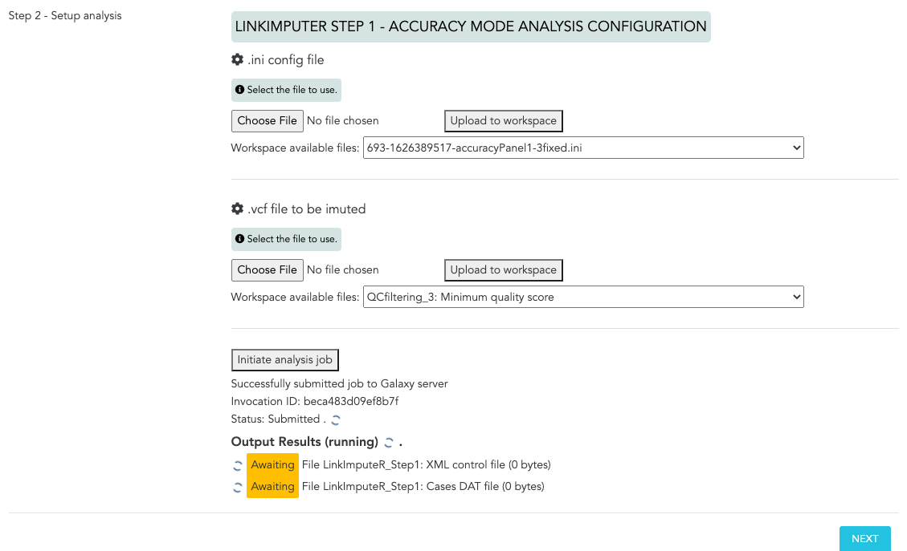

This run produces a DAT file containing the different combinations of thresholds tested and their accuracy. It can be downloaded in your computer by clicking on the link next to *File download*. In this case, we will chose "Case 5" since it yields the highest number of SNPs (7118) while maintaining a high accuracy (0.9240):


*sum.dat*
```
Name    Samples Positions	Accuracy        Correlation     Filters Additional
Case 1  393     3263    0.9290  0.8682  PositionMiss(0.2),SampleMiss(0.2),MAF(0.01)     Depth(2)
Case 2  399     4824    0.9320  0.8215  PositionMiss(0.4),SampleMiss(0.4),MAF(0.01)     Depth(2)
Case 3  402     5598    0.9160  0.7688  PositionMiss(0.6),SampleMiss(0.6),MAF(0.01)     Depth(2)
Case 4  406     6506    0.9180  0.7831  PositionMiss(0.8),SampleMiss(0.8),MAF(0.01)     Depth(2)
Case 5  409     7118    0.9240  0.7989  PositionMiss(0.9),SampleMiss(0.9),MAF(0.01)     Depth(2)
Case 6  393     2243    0.8950  0.8212  PositionMiss(0.2),SampleMiss(0.2),MAF(0.02)     Depth(2)
Case 7  399     3366    0.9090  0.8416  PositionMiss(0.4),SampleMiss(0.4),MAF(0.02)     Depth(2)
Case 8  402     4136    0.8770  0.7796  PositionMiss(0.6),SampleMiss(0.6),MAF(0.02)     Depth(2)
Case 9  406     4990    0.8670  0.7732  PositionMiss(0.8),SampleMiss(0.8),MAF(0.02)     Depth(2)
Case 10 409     5583    0.8660  0.7952  PositionMiss(0.9),SampleMiss(0.9),MAF(0.02)     Depth(2)
```

**4.** Perform the filtering and imputation using Case 5, and the xml file obtained from the previous step **(LinkImputeR Step 2: Imputation)**


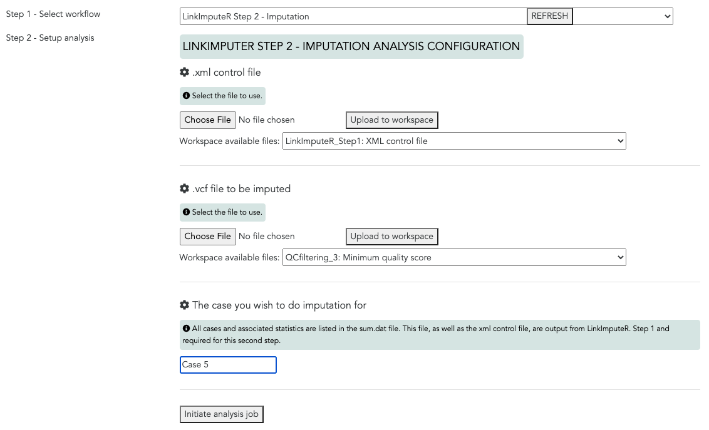

### Code
```
java -jar LinkImputeR.jar impute.xml 'Case 5' Panel1imputed.vcf
```

Where impute.xml is the name of the control file asked to be created in the ini file, Case 5 is the name of the case you want to do imputation for and Panel2imputed.vcf is the name of the filtered/imputed vcf file. CASE will have to be in quotes since the default case names include spaces. If the OUTPUT ends in .gz then the file will be gzipped.

<a name="pop"></a>
## 2. Population structure (not available yet in CartograPlant)

Correcting by population structure is key in GWAS, since it allows to avoid spurious associations or false positives. GWAS analysis uses essentially linear models to look for correlations between the SNPs (the predictor variables) and the phenotypes under study (the response variables), in the case of GxP studies. In GxE studies, the predictor variables would be the environmental variables and the response variable, the SNPs. However, correlation does not necessarily imply causation. For example, in the case of genome-environmental association analysis, the population structure may, by chance, mimic the environmental variable under study (Figure 1). Thus, the correlation between the environmental variable under study and the SNPs would be caused by non-adaptive processes, since there are a lot of non-adaptive processes that shape population structure (e. g. genetic drift, demographic history, isolation by distance). Hence, correcting by population structure previous to the GWAS will avoid these false positives.

There are a lot of ways to perform this population structure analysis, such as Principal Component Analysis (PCA), fastSTRUCTURE or discriminant analysis of principal components (DAPC), all of them available, or shortly available in CartograPlant. DAPC is a more convenient approach for populations that are clonal or partially clonal, that is, for genetically related individuals. In this multivariate statistical approach, variance in the sample is partitioned into a between-group and within- group component, in an effort to maximize discrimination between groups. In DAPC, data is first transformed using a principal components analysis (PCA) and subsequently clusters are identified using discriminant analysis (DA).

<a name="dapc"></a>
### 2.1. DAPC 

Since our SNP panels contain clonal individuals, we will use **DAPC to perform the population structure** analysis. DAPC assumes that markers are not linked. Thus, we need to **filter our SNP panels by Linkage disequilibrium**. Our Galaxy workflow performs these filters using *plink*.

- Linkage disequilibrium: Filter SNPs by linkage disequilibrium (threshold r2<0.2) to retain only independent SNPs **(SNP Quality filtering Step 9)**

```
plink --vcf Panel1imputed.vcf --double-id --allow-extra-chr --set-missing-var-ids @:# --indep-pairwise 50 5 0.2 --recode vcf --out Panel1imputedLD0.2
```

- Perform DAPC: It is performed using R **(DAPC Step1)**. Detailed [tutorial](http://adegenet.r-forge.r-project.org/files/tutorial-dapc.pdf) to perform DAPC analysis.

```
library(adegenet)
library(vcfR)

#Panel1
#The only input file needed is a vcf or vcf.gz file
vcf <- read.vcfR("Panel1imputedLD0.2.vcf")
x <- vcfR2genlight(vcf) #transform vcf to genlight
x
grp <- find.clusters(x, max.n.clust=40)#500 number of PCs (there are actually around 400 PC so by retaining 500 we ensure that all of them are kept), This graph shows a clear decrease of BIC until k = 5 clusters, after which BIC increases.In this case, the elbow in the curve also matches the smallest BIC, and clearly indicates 5 clusters should be retained.
dapc1 <- dapc(x, grp$grp) #300 PCs, 4 eigenvalues. The method displays the same graph of cumulated variance as in find.cluster. However,unlike k-means, DAPC can benefit from not using too many PCs. Indeed, retaining too many components with respect to the number of individuals can lead to over-fitting and unstability in the membership probabilities returned by the method. DAPC is implemented by the function "dapc", which first transforms the data using PCA, and then performs a Discriminant Analysis on the retained principal components.Two graphs will appear as a result to help decide the number of principal components and the number of discriminant functions to be retained. The bottomline is therefore retaining a few PCs without sacrificing too much information.Here, we can see that little information is gained by adding PCs after the first 300. We therefore retain 300 PCs.Then, the method displays a barplot of eigenvalues for the discriminant analysis, asking for a number of discriminant functions to retain. For small number of clusters, all eigenvalues can be retained since all discriminant functions can be examined without difficulty. Whenever more (say, tens of) clusters are analysed, it is likely that the first few dimensions will carry more information than the others, and only those can then be retained and interpreted. In this case, we will retain all four eigenvalues

#Plot
scatter(dapc1, posi.da="bottomleft", bg="white",
        pch=17:22, cstar=0, col=myCol, scree.pca=TRUE,
        posi.pca="bottomright")


#Membership probabilities

#Change formatting for storage and used to correct by population structure in the GWAS with EMMAX
round<-round(dapc1$posterior,3)
assignedPop<-apply(round, 1, which.max)
assignedPopframe<-as.data.frame(assignedPop)

#Including intercept
Intercept<-rep(1,times=407)
assignedPopInter<-cbind(Intercept,assignedPopframe)

#Print table
write.table(assignedPopInter,"Panel1assignedPopDAPC.txt", col.names=F,quote=F,sep=" ")

#Panel2
#The only input file needed is a vcf or vcf.gz file
vcf <- read.vcfR("Panel2imputedLD0.2.vcf")
x <- vcfR2genlight(vcf) #transform vcf to genlight
x
grp <- find.clusters(x, max.n.clust=40)#1000 number of PCs (there are actually around 900 PC so by retaining 1000 we ensure that all of them are kept), This graph shows a clear decrease of BIC until k = 2 clusters, after which BIC increases.In this case, the elbow in the curve also matches the smallest BIC, and clearly indicates 2 clusters should be retained.
dapc1 <- dapc(x, grp$grp) #600 PCs, 1 eigenvalue. The method displays the same graph of cumulated variance as in find.cluster. However,unlike k-means, DAPC can benefit from not using too many PCs. Indeed, retaining too many components with respect to the number of individuals can lead to over-fitting and unstability in the membership probabilities returned by the method. DAPC is implemented by the function "dapc", which first transforms the data using PCA, and then performs a Discriminant Analysis on the retained principal components.Two graphs will appear as a result to help decide the number of principal components and the number of discriminant functions to be retained. The bottomline is therefore retaining a few PCs without sacrificing too much information.Here, we can see that little information is gained by adding PCs after the first 600. We therefore retain 600 PCs.Then, the method displays a barplot of eigenvalues for the discriminant analysis, asking for a number of discriminant functions to retain. For small number of clusters, all eigenvalues can be retained since all discriminant functions can be examined without difficulty. Whenever more (say, tens of) clusters are analysed, it is likely that the first few dimensions will carry more information than the others, and only those can then be retained and interpreted. In this case, we will retain the only eigenvalue displayed (1)

#Plot
scatter(dapc1, posi.da="bottomleft", bg="white",
        pch=17:22, cstar=0, col=myCol, scree.pca=TRUE,
        posi.pca="bottomright")

scatter(dapc1)
#Membership probabilities

#Change formatting to correct by population structure in the GWAS with EMMAX
round<-round(dapc1$posterior,3)
assignedPop<-apply(round, 1, which.max)
assignedPopframe<-as.data.frame(assignedPop)

#Including intercept
Intercept<-rep(1,times=407)
assignedPopInter<-cbind(Intercept,assignedPopframe)

#Print table
write.table(assignedPopInter,"Panel1assignedPopDAPC.txt", col.names=F,quote=F,sep=" ")
```

- **The DAPC for Panel1 looks like this:**

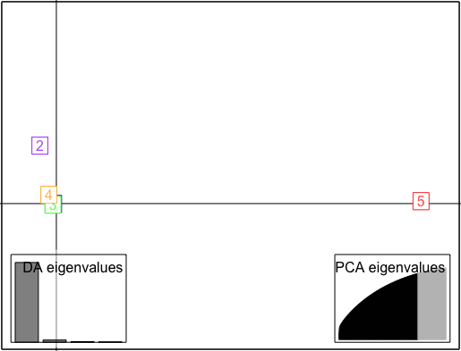

The printed table looks like this:

```
206_206 1 3
207_207 1 3
208_208 1 3
209_209 1 1
210_210 1 1
211_211 1 3
212_212 1 3
```

So we have to separate the two ID numbers of the first column. CartograPlant will use this code **(DAPC Step2)**:

```
sed 's/_/\t/g' Panel1assignedPopDAPC.txt
```

Make sure that the population structure txt file has the following format (famID, indID, intercept, population) to accomplish the format requisites for EMMAX program:

```
206 206 1 3
207 207 1 3
208 208 1 3
209 209 1 1
210 210 1 1
211 211 1 3
212 212 1 3
```

<a name="pcafast"></a>
### 2.2. Principal Component Analysis (PCA) and fastSTRUCTURE

For natural populations or any study design containing non-clonal individuals, we can use PCA and fastSTRUCTURE to perform the population structure analysis. PCA and STRUCTURE-like approaches assume that markers are not linked and that populations are panmictic (Pritchard et al., 2000). Thus, we need to filter our SNP panels by Hardy-Weingberg equilibrium and by Linkage disequilibrium. Our Galaxy workflow performs these filters using *plink*.

- Hardy-Weingberg equilibrium: This code excludes markers that failure the Hardy-Weinberg test at a specified significance threshold (0.000001 in this case) (SNP quality filtering Step 7)

```
plink --vcf Panel2imputed.vcf --double-id --allow-extra-chr --set-missing-var-ids @:# --hwe 0.000001 --recode vcf --out Panel2imputedhwe
```

- Linkage disequilibrium: Filter SNPs by linkage disequilibrium (threshold r2<0.2) to retain only independent SNPs (SNP Quality filtering Step 9)

```
plink --vcf Panel2imputedhwe.vcf --double-id --allow-extra-chr --set-missing-var-ids @:# --indep-pairwise 50 5 0.2 --recode vcf --out Panel2imputedhweLD0.2
```

### 2.2.1 Principal Component Analysis (PCA)

Now, we are going to use *plink* again to calculate the *eigenvalues* and *eigenvectors* needed to plot the PCA. The PCA plot will inform us about the number of populations in our dataset. This information is necessary to run the fastSTRUCTURE analysis, since we have to specify the number of ancestral populations that fastSTRUCTURE should create.

```
plink --vcf Panel2imputedhweLD0.2.vcf --double-id --allow-extra-chr --set-missing-var-ids @:# --make-bed --pca --out PCAPanel2
```

This code produces 5 output files:

- PCAPanel2.eigenval
- PCAPanel2.eigenvec
- PCAPanel2.bed
- PCAPanel2.bim
- PCAPanel2.fam

The first one contains the eigenvalues and the second the eigenvectors. Both of them are needed to plot the PCA. CartograPlant use R to do so (via Galaxy), and the following code:

```
# install.packages("tidyverse")
# load tidyverse package
library(tidyverse)

# read in data
pca <- read_table2("PCAPanel2.eigenvec", col_names = FALSE)
eigenval <- scan("PCAPanel2.eigenval")

# sort out the pca data
# remove nuisance column
pca <- pca[,-1]
# set names
names(pca)[1] <- "ind"
names(pca)[2:ncol(pca)] <- paste0("PC", 1:(ncol(pca)-1))
head(pca)

# first convert to percentage variance explained
pve <- data.frame(PC = 1:20, pve = eigenval/sum(eigenval)*100)

# make plot
a <- ggplot(pve, aes(PC, pve)) + geom_bar(stat = "identity")
a + ylab("Percentage variance explained") + theme_light()

# calculate the cumulative sum of the percentage variance explained
cumsum(pve$pve)

# plot pca
ggplot(pca, aes(PC1, PC2)) + geom_point()
```

### 2.2.2 fastSTRUCTURE

The following steps have the objective of transforming the vcf files containing the SNPs into a .bed, .fam and .bim files, required as inputs to run fastSTRUCTURE program. To this end, this workflow makes use of *plink* (fastSTRUCTURE Step 1):

```
plink --vcf Panel2imputedhweLD0.2.vcf --allow-extra-chr --double-id --make-bed --out Pane21imputedhweLD0.2
```

- Run fastSTRUCTURE

```
structure.py -K 2 --input=Panel2imputedhweLD0.2 --output=Panel2imputedhweLD0.2 --full
```

In the above command, -K 2 specifies the number of ancestral populations that fastStructure should create. Both panels (1 and 2) showed 2 populations in the PCA.

This code produces five output files:

- Panel2imputedLD0.2.2.log
- Panel2imputedLD0.2.2.meanP
- Panel2imputedLD0.2.2.meanQ
- Panel2imputedLD0.2.2.varP
- Panel2imputedLD0.2.2.varQ

We are going to use the *meanQ* file to perform the population structure correction during the GWAS.This *meanQ* file contains 1 row for each sample, and 1 column for each ancestral population. The numbers give the proportion of the genome inferred to have come from the ancestral population.

The format has to be changed to accomplish the requisites of the program we are going to use to perform GWAS: EMMAX. The population structure file has to have three entries at each line, FAMID, INDID, intercept (so the third column is recommended to be 1 always) and the population to which each individual belongs.

**1.** Extract the ID of the individuals from the .fam file (obtained from running "fastSTRUCTURE Step 1").

```
awk 'BEGIN { OFS = "_" } ;{print $1,$2}' Panel2imputedLD0.2.fam > IDPanel2.txt
sed 's/_/\t/g' IDPanel2.txt > IDPanel2tab.txt
awk '{print $1,$2}' IDPanel2tab.txt > IDfamPanel2.txt
```


Now we will use these proportions to assign each individual to a particular population. To this end, CartograPlant will use R. The R code below assigns an individual to a population based on whichever ancestral genome has the highest proportion. This assignment can be problematic for heavily admixed individuals.

```
fs <-read.table("Panel2imputedLD0.2.2.meanQ", header=F)
fs$assignedPop <- apply(fs, 1, which.max)
```
Create the intercept column and add it to the table :

```
intercept<-rep(1,882)#the second number correspond with the number of individuals in each dataset, in the case of panel 2, 882 individuals
fsintercept<-cbind(intercept,fs)
```

Read the ID names and add the individual IDs to the table

```
ID<-read.table("IDfamPanel2.txt")
fsID<-cbind(ID,fsintercept)
```
Retain only the first column (Individual IDs) and the last column (population assignment):

```
fsPop<-fsID[,c(1,2,3,6)] # the forth number is the number of ancestral populations created by fastSTRUCTURE + 4
```

Write a txt table, space delimited, to be included as covariate in EMMAX GWAS analysis:

```
write.table(fsPop,"assignedPopPanel2.txt", col.names=F,quote=F,sep=" ")
```
Here finished the R code

A final step is to remove the first column (bug from the R code):

```
cut -d\  -f2- assignedPopPanel2.txt > assignedPopPanel2final.txt
```

Make sure that the population structure txt file has the following format (famID, indID, intercept, population):

```
201782 400194 1 2
201782 400495 1 2
201782 400549 1 1
201782 400577 1 2
201782 400578 1 2
201782 400579 1 1
201782 400580 1 2
201782 400581 1 1
201782 402439 1 2
201782 402440 1 1
```

<a name="blup"></a>
## 3. Best Linear Unbiased Predictors (BLUPs) calculation (not available in CartograPlant yet, but it will be available soon)

The phenotypic variables we are using to perform the GWAS are bud set, bud flush and height. Phenology traits, such as bud set and bud flush, are highly related to fitness and show high heritability. On the other hand, height in trees and growth-related phenotypes in general can be considered as a proxy for fitness and they are also traits associated with the genotype. Thus, a strong selection over all these phenotypic traits is expected (Aitken and Bemmels 2015). All these characteristics makes them ideal to perform GWAS.

Estimating best linear unbiased predictors (BLUPs) for traits allows to obtain standardized data that can be compared across experiments, locations and years. In particular, BLUPs are used in linear mixed models for the estimation of random effects. This calculation will allow us to account for environmental factors in our model.

Since the phenotypic measures were collected from clonal individual replicates located in multiple provenances (common-garden locations) and measured in different years. All these factors (clonar replications, locations and years) act as random effects, since they can influence the phenotypic values. In GWAS, our objective is to identify the genetic variants influencing the phenotypes of interest, not the environmental variables influencing the phenotypes. Thus, for GWAS studies, we need to correct for all these random effects in the phenotypic dataset (replicate or line, location and year) before using it in GWAS, to generate more precise estimates of genotypic values.

Our workflow will perform this BLUP analysis in R, using the following code **(BLUP Step 1)**. It is not available yet, but it will be available soon:

```
## Read the phenotype datasets
budflush = read.csv("Panel2Budflush.csv", header=T)
budset = read.csv("Panel2Budset.csv", header=T)
height = read.csv("Panel2Height.csv", header=T)

## Attach dataset
attach(budflush)
attach(budset)
attach(height)

## Examine distribution of the phenotype
hist(Height, col="gold")
boxplot(Height~Loc, xlab="Location", ylab="Degrees Height", main="Degrees Phenotype by Location", col="pink")

# Rename variables for ease of use
Pheno = as.numeric(height$Height)
LINE = as.factor(height$Geno)
LOC = as.factor(height$Loc)
YEAR = as.factor(height$Year)
REP = as.factor(height$Block)

## Calculate variance components
# requires lme4 package
library(lme4)


## BLUPS
# fit the model
options(lmerControl=list(check.nobs.vs.rankZ = "warning", check.nobs.vs.nlev = "warning",
                         check.nobs.vs.nRE = "warning", check.nlev.gtreq.5 = "warning", check.nlev.gtr.1 = "warning"))

phenomodel = lmer(Pheno ~ (1|LINE) + (1|LOC) + (1|YEAR) + (1|LINE%in%LOC:YEAR) + (1|LINE:LOC) + (1|LINE:YEAR),na.action = na.omit)

# estimate BLUPS
blup = ranef(phenomodel)
# look at output structure
str(blup)
# extract blup for line
lineblup = blup$LINE
# see the structure of the blup for each line
str(lineblup)
# save the lineblup output to a separate .txt file
write.table(lineblup,"Panel2heightBLUP.txt", col.names=F,quote=F,sep=" ")
```
The phenotype distributions for the Panel 2 look like this: 

- **Budflush histogram:**

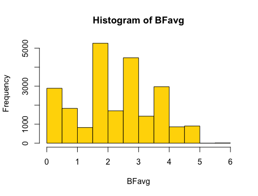

- **Budset histogram:**

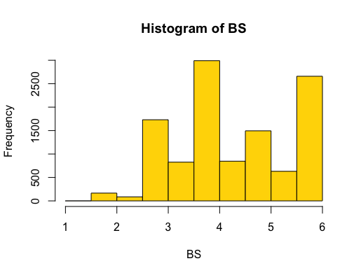

- **Height histogram:**

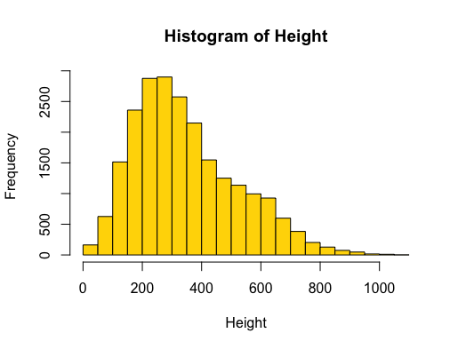

- **Budflush per location Boxplot:**

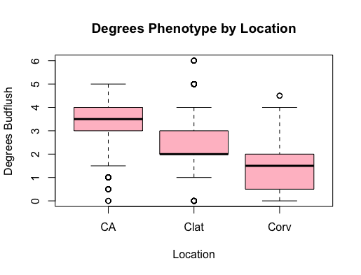

- **Budset per location Boxplot:**

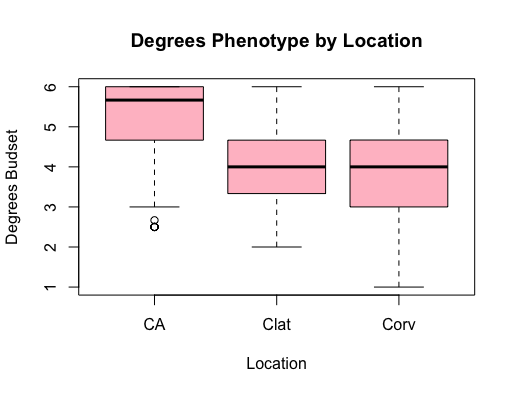

- **Height per location Boxplot:**


Phenotype files have to match the format type requisites for EMMAX (file containing three entries at each line, FAMID, INDID, and phenotype values, one phenotype value per file, tab or space separated). Thus, we need to double the first column **(BLUP Step 2)**:

```
awk '{print $1,$1,$2}' Panel2heightBLUP.txt > Panel2heightBLUPEMMAX.txt
```

Make sure that the phenotype file looks like this:

```
206 206 4.109382343
207 207 4.638584558
208 208 4.305659377
209 209 NA
210 210 -4.146701147
211 211 -1.905807886
212 212 4.109382343
```

<a name="gwas"></a>
## 4. Genome Wide Association Analysis (GWAS) 

A genome-wide association study (GWAS) is an approach used in genetics research to associate specific genetic variations (usually single nucleotide polymorphisms or SNPs) with traits of interest. To this end, a model (normally a regression model) is used to associate a predictor variable (the genotype data, usually single nucleotide polymorphisms or SNPs), and a response variable, the resulting phenotypes. CartograPlant makes use of Linear Mixed Models to perform GWAS, using two approaches (frequentist and bayesian). 

Statistically speaking, there are two main approaches for perform data analysis: Frequentist and Bayesian methods. Frequentist methods make predictions on the underlying truths of the experiment using only data from the current experiment. On the other hand, Bayesian probability specifies that there is some prior probability. Based on this prior probability or distribution, the Bayesian methods calculate the posterior distribution, which is a probability distribution that represents your updated beliefs about the parameter after having seen the data. As a result, in the Bayesian approach, a probability is assigned to a hypothesis. In the frequentist approach, a hypothesis is tested without being assigned a probability.

These two approaches to perform GWAS in CartograPlant, using LMM, increases the flexibility of our workflows for a diversity of data types and study designs. 

<a name="emmax"></a>
### 4.1. EMMAX (frequentist)

**EMMAX is a linear mixed model** (LMM) to perform GWAS, **correcting by a wide range of sample structures** (which encompasses population stratification and hidden relatedness) using a frequentist approach. To this end, it uses an **internally calculated kinship matrix as a random effect, and population structure externally calculated as a fixed effect**. This population structure correction is a key step in GWAS to avoid spurious associations.

**Any kind of structure in the study population can lead to spurious associations or false positives in the GWAS** (e. g. population stratification, kinship). For this reason, it is necessary to correct by these structures prior to the GWAS. Population structure is the presence of subgroups in the population with ancestry-related genetic differences (and other non-adaptive genetic differences, caused, for instance, by isolation by distance, genetic drift, kinship etc.).

The objective of GWAS is to identify the causative alleles of the traits of interest. These hidden sample structures can act as **confounding variables**, leading to false positives. In statistics, a confounding effect is a extraneous variable in a statistical model that correlates with both the dependent and the independent variable. 

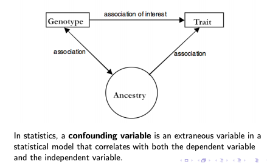

The use of LMM such as EMMAX to perform GWAS ensures the flexibility of our workflow for a diverse of data types and study designs, since it allows to analyze studies containing genetically related or clonal individuals (because it corrects by kinship) and also, studies containing natural populations, that may have some population stratification.  

Now, we will run EMMAX in CartograPlant to perform the GWAS using the phenotypic data and correcting by population structure, extenally calculated using DAPC in our case, and kinship, internally calculated. 

This is the code/rationale behind the GWAS in EMMAX performed in CartograPlant:

EMMAX needs the SNPs to be in *.ped* or *.bed* format.

CartograPlant transforms the *.vcf* file to *.ped* format using *vcftools* and the following code **(GWAS with EMMAX. Step 1)**:

```
vcftools --vcf Panel1imputed.vcf --plink --out Panel1imputed
```

We will transform the imputed *.vcf* files before and after being filtered by Linkage disequilibrium. We will use the SNPs before LD filtering to perform the GWAS and after filtering to build the kinship matrix.

Then, CartograPlant will use PLINK software to transpose the genotype files in *.ped* format to *tped/tfam* format by running **(GWAS with EMMAX. Step 2)**:

```
plink --file Panel1imputed --recode12 --output-missing-genotype 0 --transpose --out Panel1imputed
```

Kinship matrix is performed in CartograPlant using EMMAX **(GWAS with EMMAX. Step 3)**:

```
./emmax-kin-intel64 -v -d 10 Panel1imputedLD0.2
```

The final step is run GWAS analysis in EMMAX using the genotypes (-t), phenotype file, each variable at a time (-p), the kinship matrix (-k), the population structure file as covariate (-c). "-o" is the name of the output **(GWAS with EMMAX. Step 4)**.

```
./emmax-intel64 -v -d 10 -t Panel1imputed -p Panel1_VA_Budflush_IDorder.txt -k Panel1imputedLD0.2.aBN.kinf -c Panel1assignedPopDAPC.txt -o Panel1BudflushEMMAXresults
```
Make sure that the population structure txt file has the following format: First and second column, family name and individual name, in the same order as in the vcf file. Third column is the "intercept", meaning that the third column is recommended to be 1 always, and finally, forth column has to contain a list of numbers representing the population to which each individual belongs (famID, indID, intercept, population) to accomplish the format requisites for EMMAX program. Individual IDs (indID) have to be in the same order as the *vcf* file:

```
206 206 1 3
207 207 1 3
208 208 1 3
209 209 1 1
210 210 1 1
211 211 1 3
212 212 1 3
```
And the phenotype file, the following format (famID, indID, and phenotype value), very similar to the population structure file without the intercept column, to accomplish the format requisites for EMMAX program. Lacking phenotype data has to be typed as *NA*:

```
206 206 4.109382343
207 207 4.638584558
208 208 4.305659377
209 209 NA
210 210 -4.146701147
211 211 -1.905807886
212 212 4.109382343
```

The GWAS analysis in EMMAX produces five outputs. One of them is a *.ps* format file. In this *.ps* file, each line consists of:
- SNP ID
- Beta (1 is effect allele)
- SE(beta)
- p-value

In addition, to internally calculate the kinship matrix, we need markers that are not linked. Thus, we need to **filter our SNP panels by Linkage disequilibrium**. Our Galaxy workflow performs these filters using *plink*. To this end, we need to select "SNP Quality filtering Step 9" among the workflows available in CartograPlant:


It will look like this. As input file, it uses the imputed and filtered SNPs in a vcf file (the output obtained after running LinkImputeR Step 2):

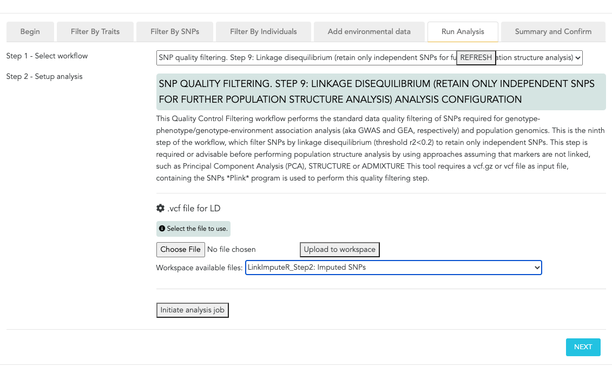

### Code
- Linkage disequilibrium: Filter SNPs by linkage disequilibrium (threshold r2<0.2) to retain only independent SNPs **(SNP Quality filtering Step 9)**

```
plink --vcf Panel1imputed.vcf --double-id --allow-extra-chr --set-missing-var-ids @:# --indep-pairwise 50 5 0.2 --recode vcf --out Panel1imputedLD0.2
```

Finally, to perform GWAS with EMMAX in CartograPlant, it is necessary to select the workflow *GWAS with EMMAX"


You will see something like this in CartograPlant, where you can select all the needed input files in the correct format that we have prepared in previous steps, and click "Initiate analysis job":

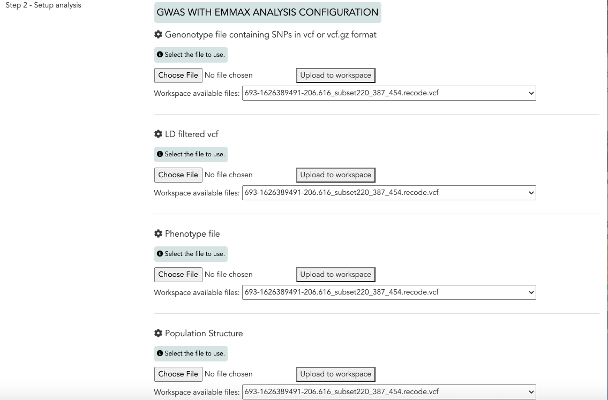

You will obtain several output files, one of them, containing the p-values for each SNP (GWASwithEMMAX_Step 4: 1. SNPID, 2. Beta, 3. SE, 4. p-value). The p-values are in the forth column of this file. They need to be corrected by multiple testing. We explain how to do so in the following section. 

<a name="fast"></a>
### 4.2. Fast-EB-LMM (Bayesian) (not available yet in CartograPlant)

As mentioned before, linear mixed models (LMM) are a efficient method for GWAS. There are numerous forms of LMM-based GWAS methods. 

While EMMAX is a frequentist approach to perform LMM for GWAS, Fast-EB-LMM is a Bayesian approach to perform LMM. Improving statistical power and computing efficiency have always been the research hotspots of the LMM-based GWAS methods. [Fast-EB-LMM](https://doi.org/10.3390/ani9060305) is a fast empirical Bayes method, which is based on linear mixed models. The novelty of this method is that it uses a modified kinship matrix accounting for individual relatedness to avoid competition between the locus of interest and its counterpart in the polygene. This property has increased statistical power. The documentation for this program can be found [here](https://github.com/fastlmm/FaST-LMM/) and [here](https://github.com/fastlmm/FaST-LMM/blob/master/README.md) the "README".

<a name="gea"></a>
## 5. Genome-Environment association analysis (GEA) and epigenome-wide association studies (EWAS) with LFMM 2 (not available yet in CartograPlant)
[**LFMM 2**](https://academic.oup.com/mbe/article/36/4/852/5290100) implements a latent factor mixed model (LFMM) to perform Genome-Environment association analysis. Thus, this model allows to correct by confounding effects in the data set, such as population structure. It makes use of a least-squares estimation approach for confounder estimation that provides a unique framework for several categories of genomic data, not restricted to genotypes (e. g. DNA methylation). As a consequence, this program not only perform genome-environment association analysis (GEA) using SNPs but also epigenome-wide association studies (EWAS) using DNA methylation levels. The developers of this program extent the definition of the LFMM data matrix to DNA methylation profiles and other molecular markers within a unified framework.


<a name="multi"></a>
## 6. Multiple testing correction (not available yet in CartograPlant, but it will be available soon)
The last step of the GWAS is correcting the p-values for Multiple Testing.

When we set a p-value threshold of, for example, 0.05, we are saying that there is a 5% chance that the result is a false positive. In other words, although we have found a statistically significant result, there is, in reality, no difference in the group means. While 5% is acceptable for one test, if we do lots of tests on the data, then this 5% can result in a large number of false positives. For example, if there are 2000 compounds in an experiment and we apply an Anova or t-test to each, then we would expect to get 100 (i.e. 5%) false positives by chance alone. This is known as the multiple testing problem.

While there are a number of approaches to overcoming the problems due to multiple testing, they all attempt to assign an adjusted p-value to each test or reduce the p-value threshold from 5% to a more reasonable value. Many traditional techniques such as the Bonferroni correction are too conservative in the sense that while they reduce the number of false positives, they also reduce the number of true discoveries. The False Discovery Rate approach is a more recent development. This approach also determines adjusted p-values for each test. However, it controls the number of false discoveries in those tests that result in a discovery (i.e. a significant result). Because of this, it is less conservative that the Bonferroni approach and has greater ability (i.e. power) to find truly significant results.

Another way to look at the difference is that a p-value of 0.05 implies that 5% of all tests will result in false positives. An FDR adjusted p-value (or q-value) of 0.05 implies that 5% of significant tests will result in false positives. The latter will result in fewer false positives.

Q-values are the name given to the adjusted p-values found using an optimised FDR approach. The FDR approach is optimised by using characteristics of the p-value distribution to produce a list of q-values.

To correct for Multiple Testing, CartograPlant calculates q-values to perform an optimised FDR approach using the following code in R **(Multiple testing correction)**:

```
#Read the EMMAX results
Panel1Budflush<-read.table("Panel1BudflushEMMAXresults.ps")
Panel1Budset<-read.table("Panel1BudsetEMMAXresults.ps")
Panel1Height<-read.table("Panel1HeightEMMAXresults.ps")

#Calculate the q-values
library(devtools)
install_github("jdstorey/qvalue")
library(qvalue)

Panel1Budflushpvalue<-Panel1Budflush$V4
Panel1Budsetpvalue<-Panel1Budset$V4
Panel1Heightpvalue<-Panel1Height$V4

qvaluePanel1Budflush <- qvalue(p = Panel1Budflushpvalue)
qvaluePanel1Budset <- qvalue(p = Panel1Budsetpvalue)
qvaluePanel1Height <- qvalue(p = Panel1Heightpvalue)

#See the summary of the results
summary(qvaluePanel1Budflush)
summary(qvaluePanel1Budset)
summary(qvaluePanel1Height)

#Plot them in a histogram
hist(qvaluePanel1Budflush)
hist(qvaluePanel1Budset)
hist(qvaluePanel1Height)

#Plot them in a plot
plot(qvaluePanel1Budflush)
plot(qvaluePanel1Budset)
plot(qvaluePanel1Height)

#Merge the adjusted p-values in the original tables
Panel1BudflushLFDR<-cbind(Panel1Budflush, qvaluePanel1Budflush$lfdr)
Panel1BudsetLFDR<-cbind(Panel1Budset, qvaluePanel1Budset$lfdr)
Panel1HeightLFDR<-cbind(Panel1Height, qvaluePanel1Height$lfdr)

#Filter the significant SNPs (P<0.05)
Panel1BudflushLFDR0.05<-Panel1BudflushLFDR[Panel1BudflushLFDR$`qvaluePanel1Budflush$lfdr`<0.05,]
Panel1BudsetLFDR0.05<-Panel1BudsetLFDR[Panel1BudsetLFDR$`qvaluePanel1Budset$lfdr`<0.05,]
Panel1HeightLFDR0.05<-Panel1HeightLFDR[Panel1HeightLFDR$`qvaluePanel1Height$lfdr`<0.05,]

# save the significant SNPs in a text file
write.table(Panel1BudflushLFDR0.05,"Panel1BudflushLFDR0.05.txt", col.names=F,quote=F,sep=" ")

write.table(Panel1BudsetLFDR0.05,"Panel1BudsetLFDR0.05.txt", col.names=F,quote=F,sep=" ")

write.table(Panel1HeightLFDR0.05,"Panel1HeightLFDR0.05.txt", col.names=F,quote=F,sep=" ")
```

**Results for Budflush**

- **Panel 1:**
```
Cumulative number of significant calls:

          <1e-04 <0.001 <0.01 <0.025 <0.05 <0.1   <1
p-value     1770   1774  1808   1843  1934 2101 6109
q-value     1770   1771  1787   1810  1835 1918 6109
local FDR   1770   1770  1770   1770  1770 1770 1980
```
- Q-value Histogram and plots Panel 1:

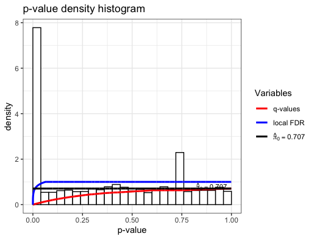
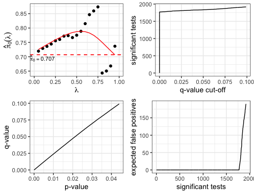

- **Panel 2:**
```
Cumulative number of significant calls:

          <1e-04 <0.001 <0.01 <0.025 <0.05 <0.1   <1
p-value       91     93   121    177   259  428 3142
q-value       91     91    91     93    94  100 3142
local FDR     91     91    91     91    91   91  724
```

- Q-value Histogram and plots Panel 2:

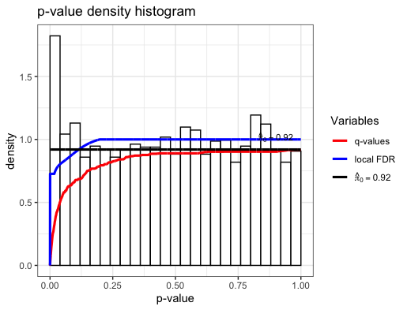
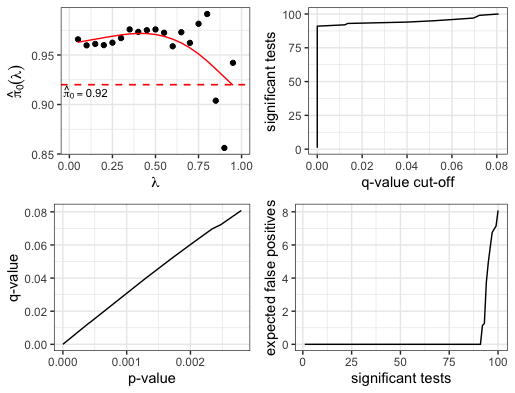

**Results for Budset**

- **Panel 1:**
```
Cumulative number of significant calls:

          <1e-04 <0.001 <0.01 <0.025 <0.05 <0.1   <1
p-value     1837   1843  1882   1935  2008 2167 6109
q-value     1837   1838  1865   1892  1940 2033 6109
local FDR   1837   1837  1837   1837  1837 1838 6109
```

- Q-value Histogram and plots Panel 1:

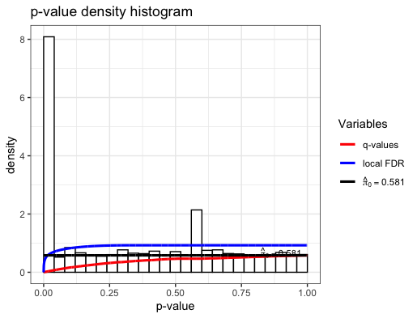
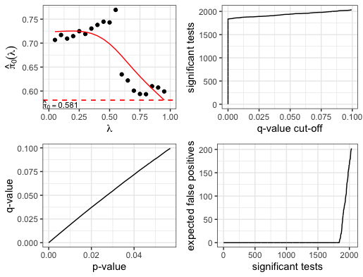


- **Panel 2:**
```
Cumulative number of significant calls:

          <1e-04 <0.001 <0.01 <0.025 <0.05 <0.1   <1
p-value        0      2    33     85   154  288 3051
q-value        0      0     0      0     0    0 1091
local FDR      0      0     0      0     0    0   97
```

- Q-value Histogram and plots Panel 2:

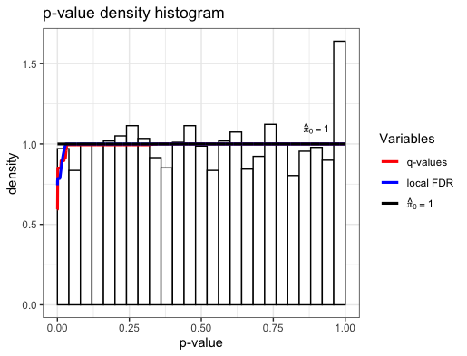
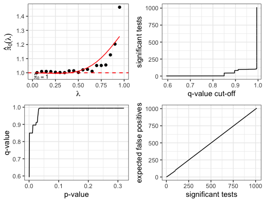

**Results for Height**

- **Panel 1:**
```
Cumulative number of significant calls:

          <1e-04 <0.001 <0.01 <0.025 <0.05 <0.1   <1
p-value        1      6    44     96   182  354 4336
q-value        0      0     0      0     0    0    6
local FDR      0      0     0      0     0    0   72
```
- Q-value Histogram and plots Panel 1:

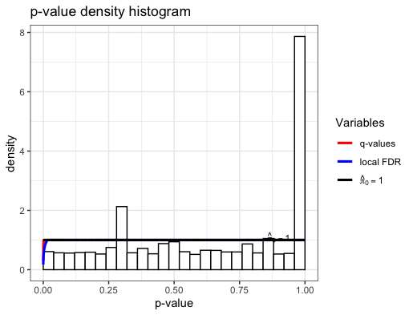
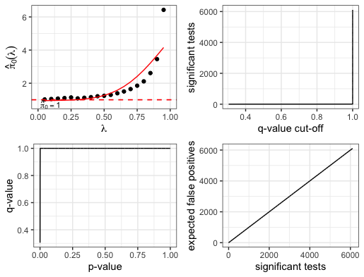

- **Panel 2:**
```
Cumulative number of significant calls:

          <1e-04 <0.001 <0.01 <0.025 <0.05 <0.1   <1
p-value       94     99   128    174   267  410 3142
q-value       91     91    95     98    99  112 3142
local FDR     91     91    91     91    91   91  318
```

- Q-value Histogram and plots Panel 2:

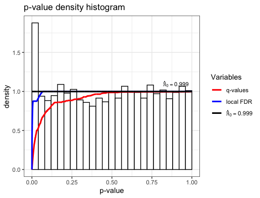
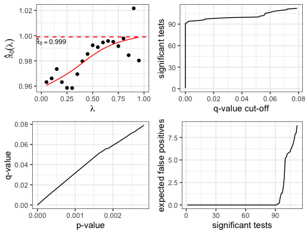

<a name="meta"></a>
## 7. Meta-Analysis with METASOFT (not available yet in CartograPlant)

[**METASOFT**](http://genetics.cs.ucla.edu/meta_jemdoc/index.html) is a free, open-source meta-analysis software tool for genome-wide association study analysis, designed to perform a range of basic and advanced meta-analytic methods in an efficient manner. 

METASOFT provides the following methods:
- Fixed Effects model (FE)
- Fixed effects model based on inverse-variance-weighted effect size.
- Random Effects model (RE)
- Conventional random effects model based on inverse-variance-weighted effect size (very conservative).
- Han and Eskin's Random Effects model (RE2)
- New random effects model optimized to detect associations under heterogeneity. (Han and Eskin, AJHG 2011)
- Binary Effects model (BE)
- New random effects model optimized to detect associations when some studies have an effect and some studies do not. (Han and Eskin, PLoS Genetics 2012)


METASOFT provides the following estimates:
- Summary effect size estimates
- Beta and standard errors for both fixed effects model and random effects model.
- Heterogeneity estimates
- Cochran's Q statistic and its p-value, and I2
- M-values
- Posterior probability that an effect exists in each study. (Han and Eskin, PLoS Genetics 2012)

