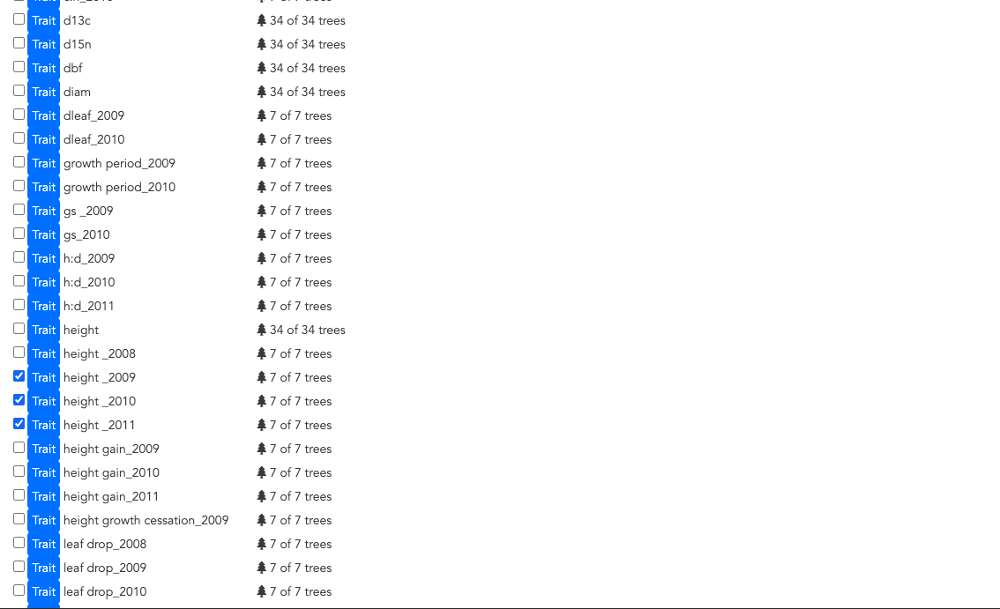

# Botany 2021 workshop: Data Collection to Analysis: Landscape Genomics with CartograPlant and WildType. July 18, 2021: Handy Guide to start using CartograPlant

Welcome!!! The objective to this Handy Guide is to get you familiar with **CartograPlant**, the web application whose features we are going to introduce you during the workshop in Botany 2021. We strongly recommend you to **read this handy guide before the workshop** and, if you have time, **follow the steps** to familiarize with all the features and data analysis concepts. This will help you follow all the demos and explanations that will be presented during the workshop and, as a result, you will make the most of your experience!

## 1. Create an account in TreeGenes

CartograPlant is a web page, so everybody can access it just by going to this website: treegenesdb.org/ct. However, to perform data analysis, it is necessary to be registered in TreeGenes.

To this end, just go to treegenesdb.org and click on the **user** icon (top right of the page).

Once there, you can **create a new account** (which is what you want to do right now), **log in** (if you already have an account), or **reset your password**. Just follow all the steps and... Congratulations!!! You are already registered on **TreeGenes** :) .

Once registered, you can log in using the e-mail and password you chose during the new account creation.

If everything is OK, you will see the following message:

You can now go to the TreeGenes main page by clicking **Home** (up-right) or the **TreeGenes logo** (up-left)

Once on the TreeGenes main page, you can go directly to CartograPlant by clicking on **CartograTree** (the old name of the page).

## 2. Getting familiar with CartograPlant web site

After clicking **CartograTree**, you will be redirected to treegenesdb.org/ct, the main page of CartograPlant. Here, you will see three icons: **Get started** (to go to CartograPlant), **Submit** (to submit data for analysis via TPPS) and **User guide**, to access to a more detailed user guide about all the CartograPlant features.

We are going to click on **Get started**. You will see the CartograPlant interface, showing a **worldwide map** (right panel) and a **left panel**. 

In the **left panel**, you can see different tabs to navigate through the map, select environmental layers, a map summary, Dataset sources and Filters. We are going to click on **Filters**. 

There, you can select the plants displayed on the worldwide map based on taxonomy, molecular markers, phenotype, plant structure, and study title, author or accession.

We are going to filter them by **study accession**. This accession numbers are assigned automatically during the study submission to TreeGenes via TPPS.

In particular we are going to select these two accession numbers: . These accession numbers correspond to two studies using *Populus trichocarpa* as a model species. Once select the accession number of interest, we have to click on **apply filter** (the green botton behind). Then in **Map summary**--> **Number of plants**, you will see the number of plants belonging to these studies (448 in the image). Click on **select all** to select them for data analysis (the button becomes green when you click on it).

## 3. Prepare data for Analysis

After selecting the plants of interests, you will see how the are displayed in the worldwide map. Then, you will click on **Analyze** (top left of the screen). This will open **CartograPlant Analysis**. You will see something like this:

In **CartograPlant** analysis, the first step is to create a **Workspace** (following the guidelines).

Once created, you can click on the next tab **Filter by traits**. There, the traits available for your selected plants are displayed. You can select the traits you want to use for further data analysis. This tool displays the overlapping traits among studies, which help with the decision of selecting the most suitable traits for your analysis.

We are going to select **bud break**, **bud set** and **height**. 

Once selected, click **Filter**. 

Once filtered, it is also possible to download the phenotypic data in a *.csv** file locally in you computer/laptop by clicking **Download**.

By clicking the tab **Add environmental data** it is also possible to select the environmental layers to use during data analysis. CartograPlant layers can be classified in two main types: US and Worldwide. Since we are going to perform a genome-phenotype association analysis, we do not need environmental layers for data analysis. But they are necessary if you want to perform genome-environmental association analysis (aka Landscape genomics).

Finally, by clicking the **Run analysis** tab, you can select the workflow you want to use to perform data analysis. [Here](https://gitlab.com/IreneCobo/botany2021workshop/-/blob/main/README2.md) is a **step-by-step tutorial for data analysis in CartograPlant**, which we also encourage you to read before the workshop.

Enjoy!!!
